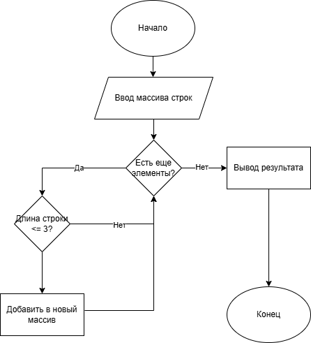

# Filter Short Strings
## Описание

Программа принимает массив строк и формирует новый массив, содержащий только те строки, длина которых **меньше или равна 3 символам**

## Алгоритм работы 

1. Ввод массива строк с клавиатуры (разделение попробелам).
2. Перебор элементов массива и фильтрация строк длиной <= 3 символов.
3. Формирование нового массива. 
4. Вывод результата.

## Пример работы
Вход:
```
Введите строки через пробел: Hello 2 world :-)
```

Выход:
```
Результат: ['2',':-)']
```

## Как запустить?

1. Установите Python (Если не установлен)
2. Скачайте код или клонируйте репозиторий.
3. Перейдите в папку проекта.
4. Запустите программу
5. Введите массив строк через пробел и получите отфильтрованный результат.

## Блок-схема алгоритма:


## Контроль версий

Проект разрабатывался с использованием Git, и каждая часть была закоммичена отдельно:
- Добалвена блок-схема.
- Добавлен Readme.md.
- Добавлен код программы.

## Автор

Zewels